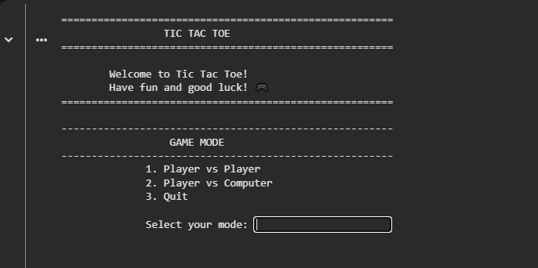
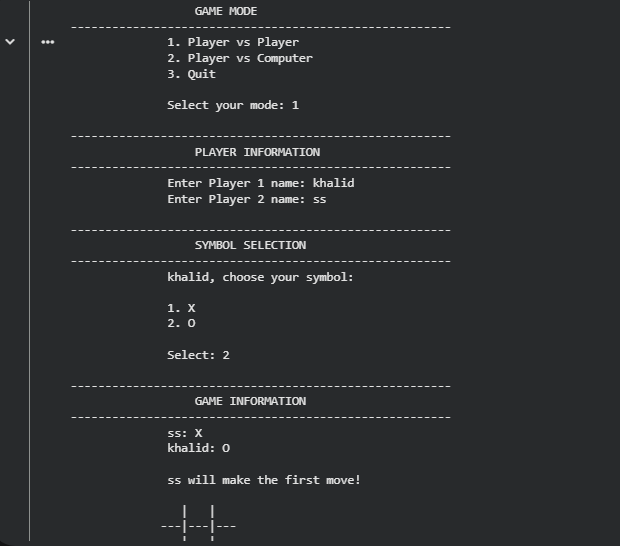
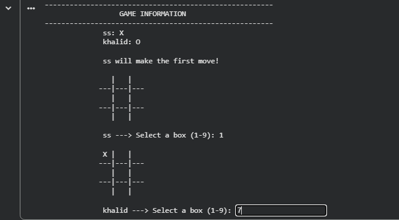
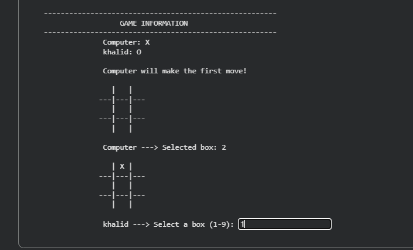
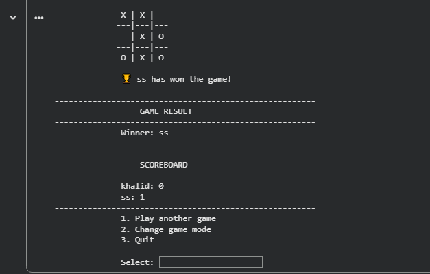

# 🎮 Tic Tac Toe Game

A simple and interactive **Tic Tac Toe** game built with Python and designed to run in the terminal.

The game supports both **Player vs Player** and **Player vs Computer** modes, with score tracking across multiple rounds.

---

## ✨ Features

* 👥 Player vs Player mode
* 🤖 Player vs Computer mode
* ❌⭕ X/O symbol selection
* 🏆 Winner detection
* 🤝 Draw detection
* 📊 Scoreboard
* 🔄 Multiple rounds
* ✅ Input validation
* 🚫 Prevents selecting an occupied box
* 👤 Player name validation
* 💻 Simple terminal interface
* 📦 No external libraries required

---

## 📸 Screenshots

### 🎮 Game Mode

The game starts by allowing the player to choose between Player vs Player and Player vs Computer.



---

### 👥 Player vs Player

Players enter their names and select their preferred symbol.



---

### 🎯 Gameplay

The Tic Tac Toe board is displayed in the terminal while the players make their moves.



---

### 🤖 Player vs Computer

The player can also play against the computer.



---

### 📊 Scoreboard

The scoreboard keeps track of the results across multiple rounds.



---

## 🎮 How to Play

### 1. Run the program

Make sure Python 3 is installed on your computer.

Open a terminal inside the project folder and run:

```bash
python tic_tac_toe_game.py
```

### 2. Choose the game mode

You can choose between:

* **Player vs Player**
* **Player vs Computer**
* **Quit**

### 3. Enter player names

For Player vs Player mode, both players enter their names.

For Player vs Computer mode, only the human player's name is required.

### 4. Choose X or O

The first player can choose either:

* `X`
* `O`

The other player automatically receives the remaining symbol.

### 5. Play the game

Players take turns selecting an available box on the board.

The first player to complete one of the winning combinations wins the round.

---

## 🏆 Winning Combinations

A player wins by placing three of their symbols in one of these combinations:

```text
1 2 3
4 5 6
7 8 9
```

The possible winning combinations are:

```text
[1, 2, 3]
[4, 5, 6]
[7, 8, 9]

[1, 4, 7]
[2, 5, 8]
[3, 6, 9]

[1, 5, 9]
[3, 5, 7]
```

---

## 🤖 Computer Mode

The game includes a **Player vs Computer** mode.

The computer automatically selects one of the available boxes during its turn.

The current version uses a simple random strategy. A smarter AI opponent could be added in a future version.

---

## 📊 Scoreboard

After each round, the game displays the current scores.

Players can continue playing multiple rounds while keeping track of their results.

---

## 🛠️ Technologies Used

* **Python 3**
* **Python Standard Library**
* `random`

No external Python packages are required.

---

## 📁 Project Structure

```text
tic-tac-toe/
│
├── tic_tac_toe_game.py
├── README.md
├── .gitignore
├── LICENSE
│
└── screenshots/
    ├── game-mode.PNG
    ├── player-vs-player.PNG
    ├── gameplay.PNG
    ├── player-vs-computer.PNG
    └── scoreboard.PNG
```

---

## 🚀 Getting Started

### Prerequisites

Make sure you have **Python 3** installed.

You can check your Python version with:

```bash
python --version
```

### Clone the Repository

```bash
git clone <YOUR-REPOSITORY-URL>
```

Then enter the project directory:

```bash
cd tic-tac-toe
```

### Run the Game

```bash
python tic_tac_toe_game.py
```

---

## 🔮 Future Improvements

Possible improvements for future versions:

* 🧠 Smarter computer AI
* 🎚️ Different difficulty levels
* 🎨 Improved terminal interface
* 🔊 Sound effects
* 📈 Detailed match statistics
* 💾 Save scores between sessions
* 🖥️ Graphical User Interface (GUI)

---

## 📚 What This Project Demonstrates

This project demonstrates practical use of:

* Functions
* Loops
* Conditional statements
* Lists
* Dictionaries
* Input validation
* Exception handling
* Random selection
* Game logic
* Program organization

---

## 👨‍💻 Author

**Khaled Abdulsalam Mansoor**

Software Engineer | PHP & Laravel Developer

Email: khalidabdualslam@gmail.com

GitHub: https://github.com/Alkamil18

LinkedIn: https://linkedin.com/in/khalid-al-kamil-6844a4172

---

## 📄 License

This project is licensed under the **MIT License**.
